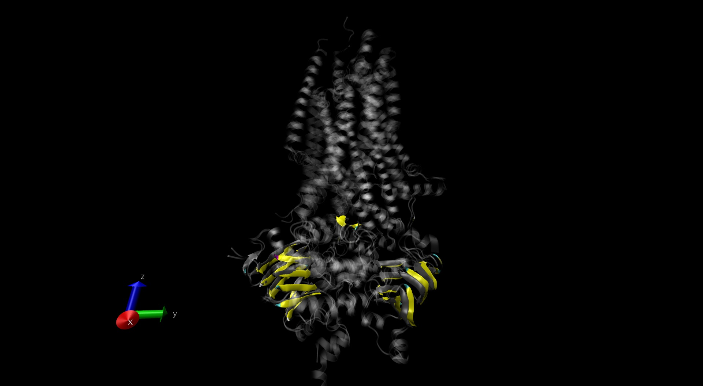
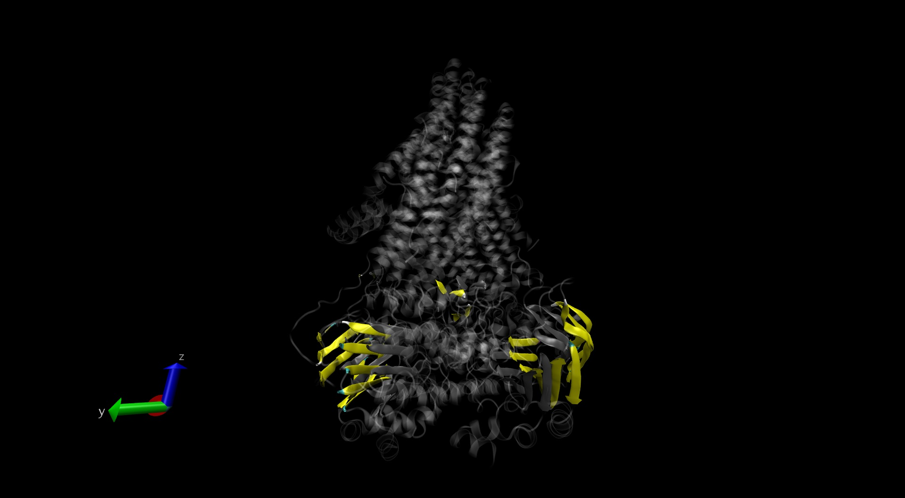

```{r setup, include=FALSE}
knitr::opts_chunk$set(echo = TRUE)
```

## Visualizations of CFTR genes

This is an R Markdown document. Markdown is a simple formatting syntax for authoring HTML, PDF, and MS Word documents. For more details on using R Markdown see <http://rmarkdown.rstudio.com>.


```{r }
#load bio3d package, view to be able to view pdb files in the markdown file
library("bio3d")
library("bio3d.view")
web.args <-list(email="brg029@ucsd.edu")
```

## Reading pdb files
I want to ultimately visualize CFTR from chickens and zebrafish to compare them to human CFTR. Being able to compare their structure can give insight into which model organism can be more well suited for use as a clinical model.


```{r}
cftr_chicken <- read.pdb("6d3s")
cftr_zebrafish <- read.pdb("5w81")
cftr_human <- read.pdb("6msm")

```
##Summary of pdb objects
```{r}
cftr_human
cftr_chicken
cftr_zebrafish
```
##Superimposing and alignment of proteins
The summaries show that chicken CFTR has 5566 protein atoms while the human and zebrafish CFTR have more than 9000. I want to align the protein sequences first and visualize them superimposed to get a clearer sense of the differences and similarities.
```{r}
pdbs <- pdbaln(list(cftr_human, cftr_chicken, cftr_zebrafish),web.args=web.args)

```
#Sequence identities
```{r}
seqidentity(pdbs)
```
```{r}
core <- core.find(pdbs)
core.inds <- print(core, vol=1.0)
#setting outpath will auto save the fitted pdbs, xyz can be used downstream for more analysis
xyz <- pdbfit(pdbs, core.inds, outpath="./")
```
##Output of alignments
All three CFTRs, Red = Chicken, Grey = Human, Blue = Zebrafish


##Exploring the conformational dynamics
Normal mode analysis is one major technique used for simulation of large biomolecules. This is important because the felxibility of a protein, it's conformation, is crucial to uderstanding the catalytic activity.

```{r}
#bio3d has a very easy to use function for calculating normal modes.
mode_man <- nma(cftr_human)


mode_chicken <- nma(cftr_chicken)

mode_zf <- nma(cftr_zebrafish)
plot(mode_man)
plot(mode_zf)
plot(mode_chicken)
```

```{r}
mode_man7 <- mktrj(mode_man, pdb=cftr_human, file="man_mode_7.pdb")
mode_ch7 <- mktrj(mode_chicken, pdb=cftr_chicken, file="ch_mode_7.pdb")
mode_zf7 <- mktrj(mode_zf, pdb=cftr_zebrafish, file="zf_mode_7.pdb")
```

**Comapring human and zebrafish CFTR**




**Human and Chicken views**
Colored = Chicken, Grey = Human
Alpha helix on left side of TMD is noticeably discordant compared to zebrafish + human



Beta sheets


```{r}
cij <- dccm(mode_man)
net <- (cij, cutoff.cij=0.2)

```


