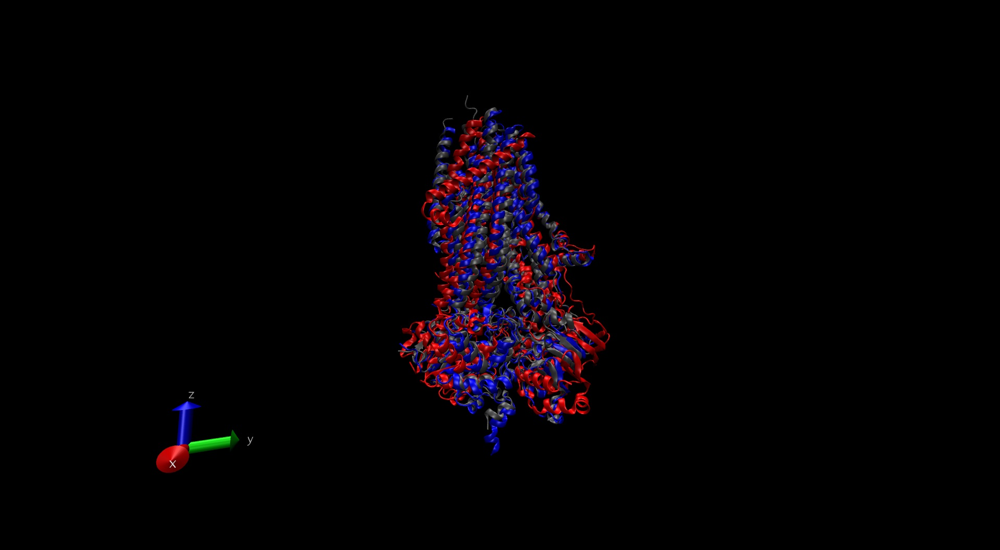
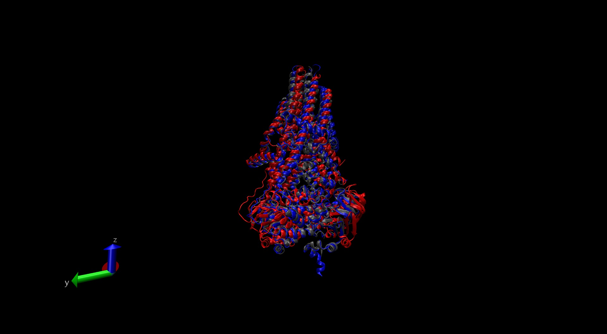
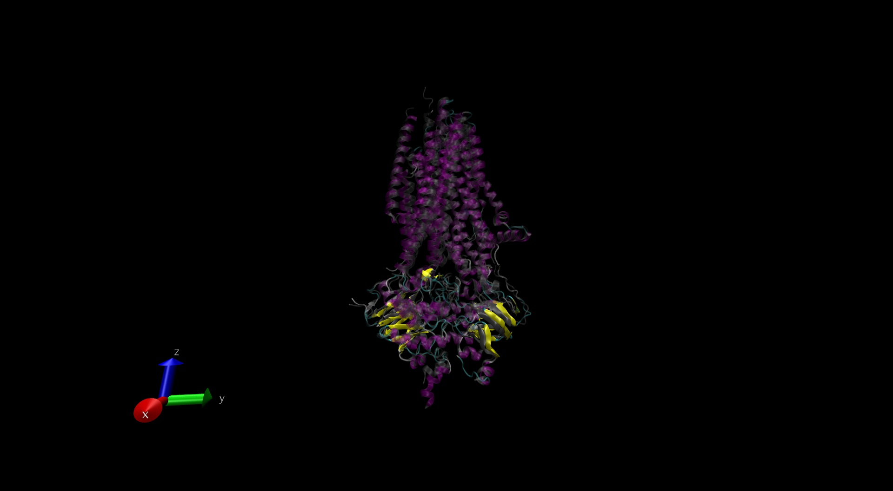
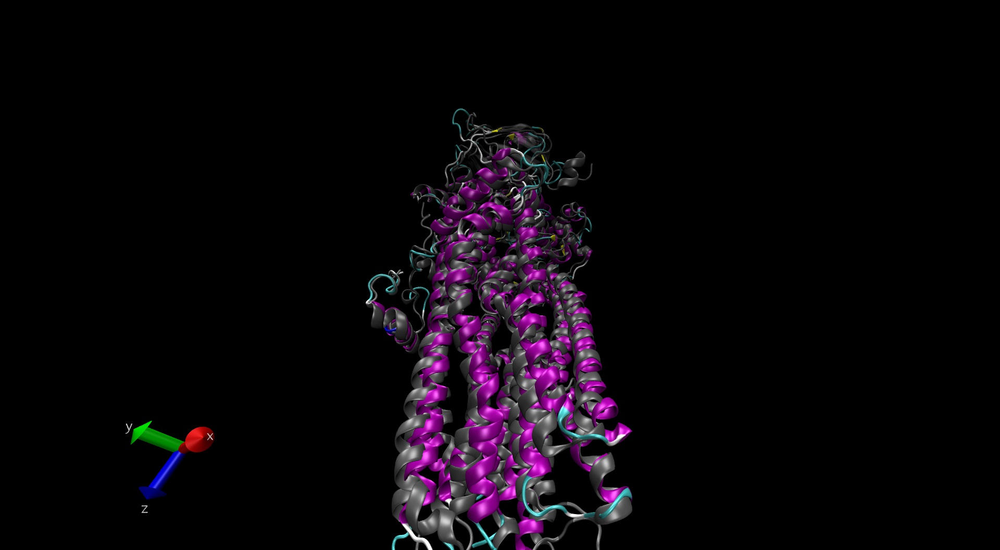
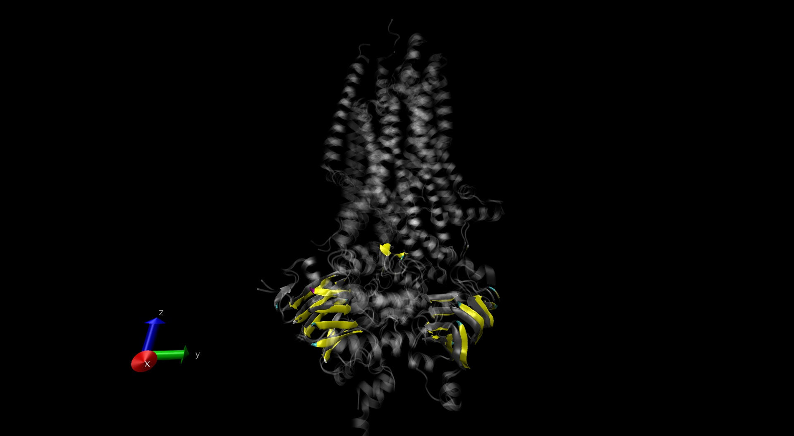
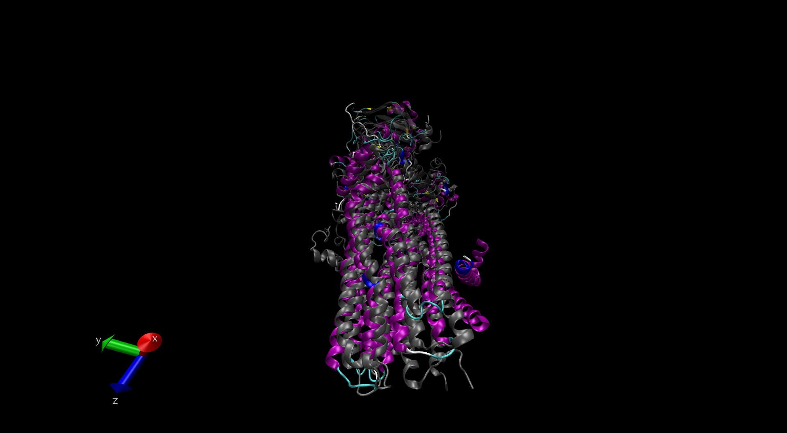
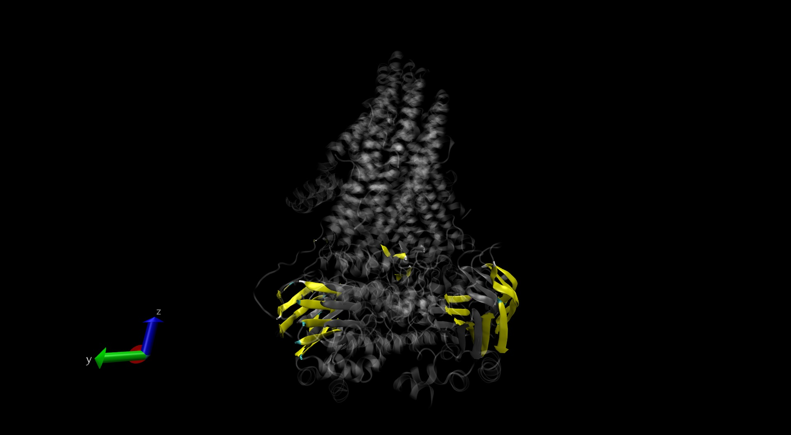
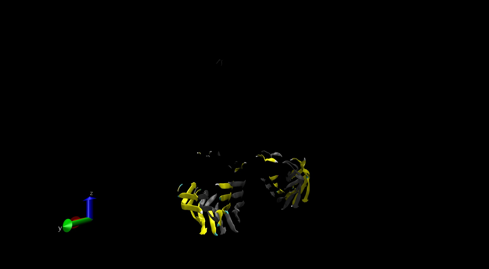

CFTR\_Examples
================
Brandon Gonzalez
February 18, 2019

Visualizations of CFTR genes
----------------------------

This is an R Markdown document. Markdown is a simple formatting syntax for authoring HTML, PDF, and MS Word documents. For more details on using R Markdown see <http://rmarkdown.rstudio.com>.

``` r
#load bio3d package, view to be able to view pdb files in the markdown file
library("bio3d")
library("bio3d.view")
web.args <-list(email="brg029@ucsd.edu")
```

Reading pdb files
-----------------

I want to ultimately visualize CFTR from chickens and zebrafish to compare them to human CFTR. Being able to compare their structure can give insight into which model organism can be more well suited for use as a clinical model.

``` r
cftr_chicken <- read.pdb("6d3s")
```

    ##   Note: Accessing on-line PDB file

``` r
cftr_zebrafish <- read.pdb("5w81")
```

    ##   Note: Accessing on-line PDB file

``` r
cftr_human <- read.pdb("6msm")
```

    ##   Note: Accessing on-line PDB file

Summary of pdb objects
----------------------

``` r
cftr_human
```

    ## 
    ##  Call:  read.pdb(file = "6msm")
    ## 
    ##    Total Models#: 1
    ##      Total Atoms#: 9703,  XYZs#: 29109  Chains#: 2  (values: A B)
    ## 
    ##      Protein Atoms#: 9466  (residues/Calpha atoms#: 1181)
    ##      Nucleic acid Atoms#: 0  (residues/phosphate atoms#: 0)
    ## 
    ##      Non-protein/nucleic Atoms#: 237  (residues: 27)
    ##      Non-protein/nucleic resid values: [ ATP (2), CLR (1), MG (2), POV (5), UNK (17) ]
    ## 
    ##    Protein sequence:
    ##       MQRSPLEKASVVSKLFFSWTRPILRKGYRQRLELSDIYQIPSVDSADNLSEKLEREWDRE
    ##       LASKKNPKLINALRRCFFWRFMFYGIFLYLGEVTKAVQPLLLGRIIASYDPDNKEERSIA
    ##       IYLGIGLCLLFIVRTLLLHPAIFGLHHIGMQMRIAMFSLIYKKTLKLSSRVLDKISIGQL
    ##       VSLLSNNLNKFDEGLALAHFVWIAPLQVALLMGLIWELLQASAFC...<cut>...KLFP
    ## 
    ## + attr: atom, xyz, seqres, helix, sheet,
    ##         calpha, remark, call

``` r
cftr_chicken
```

    ## 
    ##  Call:  read.pdb(file = "6d3s")
    ## 
    ##    Total Models#: 1
    ##      Total Atoms#: 5628,  XYZs#: 16884  Chains#: 1  (values: A)
    ## 
    ##      Protein Atoms#: 5566  (residues/Calpha atoms#: 1127)
    ##      Nucleic acid Atoms#: 0  (residues/phosphate atoms#: 0)
    ## 
    ##      Non-protein/nucleic Atoms#: 62  (residues: 2)
    ##      Non-protein/nucleic resid values: [ ATP (2) ]
    ## 
    ##    Protein sequence:
    ##       SADSADNLSEKLEREWDRELATSKKKPKLINALRRCFFWKFMFYGILLYLGEVTKSVQPL
    ##       LLGRIIASYDPDNSSERSIAYYLGIGLCLLFLVRTLLIHPSIFGLHHIGMQIRIALFSLI
    ##       YKKTLKLSSKVLDKISTGQLVSLLSNNLNKFDEGLALAHFVWIAPLQVALLMGLLWDMLQ
    ##       ASAFAGLAFLIVMAFFQAWLGQMMMKYRDKRAGKINERLVITSEI...<cut>...SLRQ
    ## 
    ## + attr: atom, xyz, seqres, helix, sheet,
    ##         calpha, remark, call

``` r
cftr_zebrafish
```

    ## 
    ##  Call:  read.pdb(file = "5w81")
    ## 
    ##    Total Models#: 1
    ##      Total Atoms#: 9393,  XYZs#: 28179  Chains#: 1  (values: A)
    ## 
    ##      Protein Atoms#: 9329  (residues/Calpha atoms#: 1173)
    ##      Nucleic acid Atoms#: 0  (residues/phosphate atoms#: 0)
    ## 
    ##      Non-protein/nucleic Atoms#: 64  (residues: 4)
    ##      Non-protein/nucleic resid values: [ ATP (2), MG (2) ]
    ## 
    ##    Protein sequence:
    ##       MQRSPVEDANCLSRYFFWWTNPIMRKGFKEKLRPSDVYQAPSQDAADILAERLEKEWDRE
    ##       VASGKKKPSLLRAMARCYIKPFLLFGFLLYIGEATKTVQPQLLGRIIASFDPAHEPERAN
    ##       GYFLAFGLGLLFTARFLLLQPAMFGLHHLGMQIRIALFSIIYKKTLKLSSRVLDKISTGQ
    ##       LVSLMSANLGKFDQSLGMAHFIWISPLQCILCTGLIWELIDVNSF...<cut>...NSSM
    ## 
    ## + attr: atom, xyz, seqres, helix, sheet,
    ##         calpha, remark, call

Superimposing and alignment of proteins
---------------------------------------

The summaries show that chicken CFTR has 5566 protein atoms while the human and zebrafish CFTR have more than 9000. I want to align the protein sequences first and visualize them superimposed to get a clearer sense of the differences and similarities.

``` r
pdbs <- pdbaln(list(cftr_human, cftr_chicken, cftr_zebrafish),web.args=web.args)
```

    ## 
    ## 
    ## Extracting sequences

    ## Warning in system(paste(exefile, ver), ignore.stderr = TRUE,
    ## ignore.stdout = TRUE): 'CreateProcess' failed to run 'C:
    ## \Users\Brandon\DOCUME~1\R\projects\BIMM143\CFTR_V~1\muscle.exe -version'

    ## 
    ## 
    ## Will try to align sequences online...
    ## 
    ## Job successfully submited (job ID: muscle-R20190220-080852-0936-3759184-p2m)
    ## Waiting for job to finish...Done.
    ## 
    ## pdb/seq: 1   name: 6msm 
    ## pdb/seq: 2   name: 6d3s 
    ## pdb/seq: 3   name: 5w81

Sequence identities
===================

``` r
seqidentity(pdbs)
```

    ##       6msm  6d3s  5w81
    ## 6msm 1.000 0.857 0.612
    ## 6d3s 0.857 1.000 0.622
    ## 5w81 0.612 0.622 1.000

``` r
core <- core.find(pdbs)
```

    ##  core size 1091 of 1092  vol = 0.006 
    ##  FINISHED: Min vol ( 0.5 ) reached

``` r
core.inds <- print(core, vol=1.0)
```

    ## # 1092 positions (cumulative volume <= 1 Angstrom^3) 
    ##   start  end length
    ## 1    42  403    362
    ## 2   437  637    201
    ## 3   845  884     40
    ## 4   913 1168    256
    ## 5  1207 1439    233

``` r
#setting outpath will auto save the fitted pdbs, xyz can be used downstream for more analysis
xyz <- pdbfit(pdbs, core.inds, outpath="./")
```

    ##   Note: Accessing on-line PDB file

    ## Warning in get.pdb(file, path = tempdir(), verbose = FALSE): C:
    ## \Users\Brandon\AppData\Local\Temp\Rtmp0eFLax/6msm.pdb exists. Skipping
    ## download

    ##   Note: Accessing on-line PDB file

    ## Warning in get.pdb(file, path = tempdir(), verbose = FALSE): C:
    ## \Users\Brandon\AppData\Local\Temp\Rtmp0eFLax/6d3s.pdb exists. Skipping
    ## download

    ##   Note: Accessing on-line PDB file

    ## Warning in get.pdb(file, path = tempdir(), verbose = FALSE): C:
    ## \Users\Brandon\AppData\Local\Temp\Rtmp0eFLax/5w81.pdb exists. Skipping
    ## download

Output of alignments
--------------------





**Comapring human and zebrafish CFTR** 





**Human and Chicken views** Alpha helix on left side of TMD is noticeably discordant compared to zebrafish + human 




