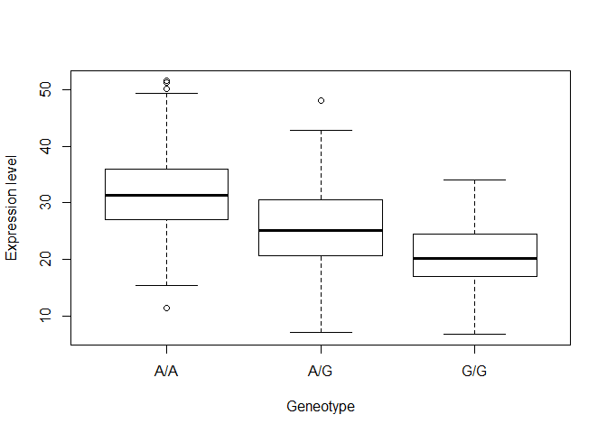
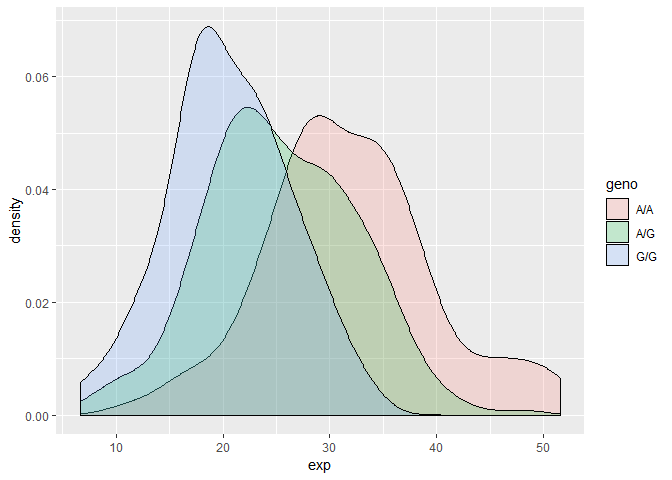

Childhood\_asthma
================
Brandon Gonzalez
February 21, 2019

Verlaan et al (2009) identified these 4 SNPs (rs12936231, rs8067378, rs9303277, and rs7216389) as having siginficant evidence for association.

Using ENSEMBL, it shows rs12936231 overlaps ZPBP2 gene location:39,872,367. rs9303277 overlaps IZKF3: Chromosome 17: 39,819,716. rs7216389 overlaps with GSDMB. rs8067378 is intergenic, location: 17: 39,894,595-39,895,595

Then look at the rs8067378 sample genotypes for people of Mexican descent in Los Angeles.

Lets read in that csv data we got.

MXL genotype variation.
-----------------------

``` r
csv_filename = "./data/rs8067378_MXL.csv"
MXL_csv <- read.csv(file=csv_filename, header=TRUE)
```

``` r
table <-table(MXL_csv$Genotype..forward.strand)
table
```

    ## 
    ## A|A A|G G|A G|G 
    ##  22  21  12   9

The percent of the population that has the G|G genotype

``` r
round(table[4]/sum(table) *100,2)
```

    ##   G|G 
    ## 14.06

Initial RNA-Seq Analysis
------------------------

Find out if this intergenic mutation affects gene expression levels. We have the sample HG00109 fastq data and looking him up on ensemble shows he has G|G genotype. Using Galaxy.

### Here is a sample of the fastqsanger output

@HW-ST546:136:D0HWFACXX:5:1101:10675:54538 GGAGGATAAGGGGGGATGGCCTGCAGAGGATCACAGCACCCATCGTTTCTGTCACAGCTTCCCCATACCCCCGCA + ++:++++=DH++@)'6&(((+(+(8(+8(+(3283&gt;ADB8?8??B<ABDCA><9@@ACBDCCCCDCCCDCDDDDDD>

firstline is origin of read, second line is the read, 3rd line is always a '+' and 4th line is the quality score line based on ASCII characters 33-126 with scores 0-93.

``` r
#lets use a sample line of score
q <- "DDDDCDDEEDEDFFFFHHHHHHJJIIJIGIJJJJIJJIJIHFD;JJIJJJIJIIJJJJJIJJHHHHHFFFFFCCC"


read_quality <- asc( s2c(q) ) - 33
```

Population scale expression levels
----------------------------------

``` r
expr_levels <- read.table(file="expr_levels.txt",header=TRUE)
head(expr_levels)
```

    ##    sample geno      exp
    ## 1 HG00367  A/G 28.96038
    ## 2 NA20768  A/G 20.24449
    ## 3 HG00361  A/A 31.32628
    ## 4 HG00135  A/A 34.11169
    ## 5 NA18870  G/G 18.25141
    ## 6 NA11993  A/A 32.89721

``` r
table(expr_levels$geno)
```

    ## 
    ## A/A A/G G/G 
    ## 108 233 121

``` r
inds = expr_levels$geno == 'G/G'
exprValGg <- expr_levels$exp[inds]
summary(exprValGg)
```

    ##    Min. 1st Qu.  Median    Mean 3rd Qu.    Max. 
    ##   6.675  16.903  20.074  20.594  24.457  33.956

``` r
inds.aa <- expr_levels$geno == 'A/A'
summary(expr_levels$geno[inds.aa])
```

    ## A/A A/G G/G 
    ## 108   0   0

``` r
inds.aa <- expr_levels$geno == 'A/G'
summary(expr_levels$geno[inds.aa])
```

    ## A/A A/G G/G 
    ##   0 233   0

Lets plot this data!

``` r
library(ggplot2)
boxplot(exp ~ geno, expr_levels, xlab="Geneotype", ylab="Expression level")
```



``` r
ggplot(expr_levels, aes(exp, fill=geno)) + geom_density(alpha = 0.2)
```


