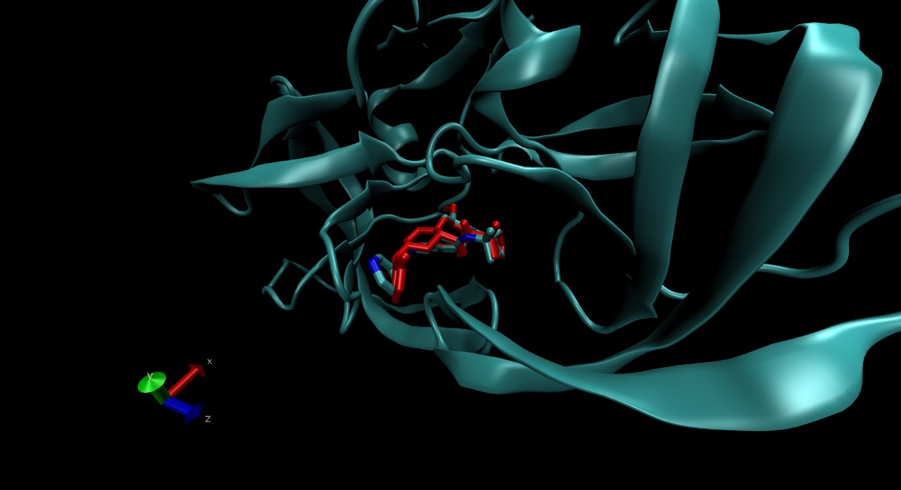
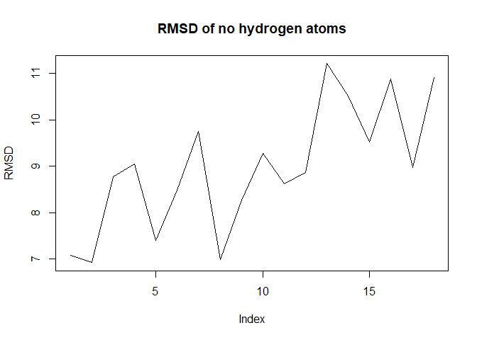

Class13 Docking and CADD
================
Brandon Gonzalez
February 19, 2019

R Markdown
----------

This is an R Markdown document. Markdown is a simple formatting syntax for authoring HTML, PDF, and MS Word documents. For more details on using R Markdown see <http://rmarkdown.rstudio.com>.

``` r
#Include library3d package
library(bio3d)
#get HIV pdb(get.pdb() downloads the hsg file locally) and read it.
file.name <- get.pdb("1hsg")
```

    ## Warning in get.pdb("1hsg"): ./1hsg.pdb exists. Skipping download

``` r
hiv <- read.pdb(file.name)
#lets print a quick summary
hiv
```

    ## 
    ##  Call:  read.pdb(file = file.name)
    ## 
    ##    Total Models#: 1
    ##      Total Atoms#: 1686,  XYZs#: 5058  Chains#: 2  (values: A B)
    ## 
    ##      Protein Atoms#: 1514  (residues/Calpha atoms#: 198)
    ##      Nucleic acid Atoms#: 0  (residues/phosphate atoms#: 0)
    ## 
    ##      Non-protein/nucleic Atoms#: 172  (residues: 128)
    ##      Non-protein/nucleic resid values: [ HOH (127), MK1 (1) ]
    ## 
    ##    Protein sequence:
    ##       PQITLWQRPLVTIKIGGQLKEALLDTGADDTVLEEMSLPGRWKPKMIGGIGGFIKVRQYD
    ##       QILIEICGHKAIGTVLVGPTPVNIIGRNLLTQIGCTLNFPQITLWQRPLVTIKIGGQLKE
    ##       ALLDTGADDTVLEEMSLPGRWKPKMIGGIGGFIKVRQYDQILIEICGHKAIGTVLVGPTP
    ##       VNIIGRNLLTQIGCTLNF
    ## 
    ## + attr: atom, xyz, seqres, helix, sheet,
    ##         calpha, remark, call

There are two non-protein residues: Water as HOH, MK1 merck's HIV drug. So this means we have to do some preprocssing to extract the protein atoms only.

``` r
#trim the pdb files 
prot <- trim.pdb(hiv, "protein")
ligand <- trim.pdb(hiv, "ligand")
#save the trimmed file
write.pdb(prot,file="1hsg_protein.pdb")
write.pdb(ligand, file="1hsg_lignad.pdb")
```

**VMD and MGL**
---------------

From the pdb files above we then used MGL to add hydrogens and calculate charges of the protein. We also used MGL to find Hydrogen bonding hydrogens and rotatble bonds of the ligand. These files were saved as \*.pdbqt files.

*1.5 Prepare a docking configuration file* "Before we can perform the actual docking, we need to create an input file that defines the protein, ligand and the search parameters." I will specify the protein and ligands to dock in this config file using a text editor. The centers and sizes are set from the parameters used in MGL viewer's ***box*** "looks something like the following: receptor = 1hsg\_protein.pdbqt ligand = ligand.pdbqt num\_modes = 50 out = all.pdbqt center\_x = XX center\_y = XX center\_z = XX size\_x = XX size\_y = XX size\_z = XX seed = 2009"

### Docking using The Scripps Research Institute's Vina

Cmd - "Files (x86)Scripps Research Institute.exe" -- config config.txt --log log.txt" this docks the ligand and protein and outputs a file called all.pdbqt that can now be viewed in R using bio3d

### Inspecting docked results

``` r
#multi = true becasue there are multiple positions of the same ligand
res <- read.pdb("all.pdbqt",multi=TRUE)
write.pdb(res,"results.pdb")
```



Qualitatively these results look really good, the first result and the PDB file are almost exactly on top of each other.

How do we quantitavely compare the docking results?
---------------------------------------------------

we will calculate the RMSD of the docking result and the PDB

``` r
library(ggplot2)
```

``` r
rmsd(ligand, res)
```

    ##  [1]  7.373  8.059  8.595  8.379  8.453  8.540  8.857  7.314  8.051  8.860
    ## [11]  8.646  8.549 10.523 11.551 10.072 11.092  9.005 11.057

``` r
#lets get the rmsd of non-hydrogen atoms
noh_ori.inds <- atom.select(ligand, string = "noh")
noh_res.inds <-  atom.select(res, string="noh")

noh_ori <- trim(ligand, inds=noh_ori.inds)
noh_res <- trim(res, inds=noh_res.inds)

plot(rmsd(noh_ori, noh_res), type = "l",ylab="RMSD",main="RMSD of no hydrogen atoms")
```



``` r
df_rmsd <- data.frame(rmsd(noh_ori, noh_res),rmsd(ligand,res))
```

Proteins are flexible
---------------------

The hiv protease example ignored these rules, here I will show an example of protein flexibility.

``` r
pdb <- read.pdb("1HEL")
```

    ##   Note: Accessing on-line PDB file

``` r
m <- nma(pdb)
```

    ##  Building Hessian...     Done in 0.02 seconds.
    ##  Diagonalizing Hessian...    Done in 0.11 seconds.

``` r
#higher the frequency means more flexible the protien is
plot(m)
```


``` r
#the out put file can be loaded into VMD and then rendered as a movie
mktrj(m , mode=7, file="nma_7.pdb")
```


