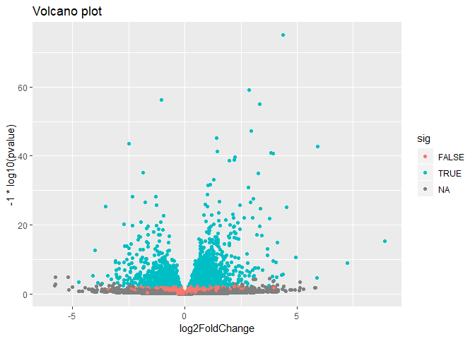

RNA Seq Analysis of Hines et al.
================

Importing countData and colData
-------------------------------

``` r
counts <- read.csv("data/airway_scaledcounts.csv", stringsAsFactors = FALSE)
metadata <- read.csv("data/airway_metadata.csv", stringsAsFactors = FALSE)
```

Preview of data
---------------

``` r
head(counts)
```

    ##           ensgene SRR1039508 SRR1039509 SRR1039512 SRR1039513 SRR1039516
    ## 1 ENSG00000000003        723        486        904        445       1170
    ## 2 ENSG00000000005          0          0          0          0          0
    ## 3 ENSG00000000419        467        523        616        371        582
    ## 4 ENSG00000000457        347        258        364        237        318
    ## 5 ENSG00000000460         96         81         73         66        118
    ## 6 ENSG00000000938          0          0          1          0          2
    ##   SRR1039517 SRR1039520 SRR1039521
    ## 1       1097        806        604
    ## 2          0          0          0
    ## 3        781        417        509
    ## 4        447        330        324
    ## 5         94        102         74
    ## 6          0          0          0

``` r
head(metadata)
```

    ##           id     dex celltype     geo_id
    ## 1 SRR1039508 control   N61311 GSM1275862
    ## 2 SRR1039509 treated   N61311 GSM1275863
    ## 3 SRR1039512 control  N052611 GSM1275866
    ## 4 SRR1039513 treated  N052611 GSM1275867
    ## 5 SRR1039516 control  N080611 GSM1275870
    ## 6 SRR1039517 treated  N080611 GSM1275871

### The colnames of the counts data must match the ids of the metadata for DESeq2 to work

``` r
#the colnames must mat
colnames(counts)
```

    ## [1] "ensgene"    "SRR1039508" "SRR1039509" "SRR1039512" "SRR1039513"
    ## [6] "SRR1039516" "SRR1039517" "SRR1039520" "SRR1039521"

``` r
#all() checks that everything returned is TRUE or else it will return false, lets use this to check that the Ids match
all( colnames(counts)[-1] == metadata$id )
```

    ## [1] TRUE

### Lets find out which columns in *counts* are the control conditions.

Then we find out what is the mean of count value for each gene.

``` r
cntrl.inds = metadata$dex == "control"
#get the ids of the cntrl cells
cntrl.ids <- metadata$id[cntrl.inds]

#get only the cntrl cells from the counts matrix
cntrl.matrix <- counts[cntrl.ids]
```

``` r
head(cntrl.matrix)
```

    ##   SRR1039508 SRR1039512 SRR1039516 SRR1039520
    ## 1        723        904       1170        806
    ## 2          0          0          0          0
    ## 3        467        616        582        417
    ## 4        347        364        318        330
    ## 5         96         73        118        102
    ## 6          0          1          2          0

``` r
mean <- rowSums(cntrl.matrix) / length(cntrl.matrix)
#ncol(cntrl.matrix) also gives the length # of columns
cntrl.means <- rowMeans(cntrl.matrix)
all( cntrl.means == mean )
```

    ## [1] TRUE

``` r
names(cntrl.means) <- counts$ensgene 
cntrl.means[1:10]
```

    ## ENSG00000000003 ENSG00000000005 ENSG00000000419 ENSG00000000457 
    ##          900.75            0.00          520.50          339.75 
    ## ENSG00000000460 ENSG00000000938 ENSG00000000971 ENSG00000001036 
    ##           97.25            0.75         5219.00         2327.00 
    ## ENSG00000001084 ENSG00000001167 
    ##          755.75          527.75

Lets do the same thing for the *treated* cells
----------------------------------------------

``` r
treated.inds = metadata$dex == "treated"

treated.ids <- metadata$id[treated.inds]

#get only the treated cells from the conts matrix
treated.matrix <- counts[treated.ids]
```

``` r
treated.means <- rowMeans(treated.matrix)
names(treated.means) <- counts$ensgene
treated.means[1:10]
```

    ## ENSG00000000003 ENSG00000000005 ENSG00000000419 ENSG00000000457 
    ##          658.00            0.00          546.00          316.50 
    ## ENSG00000000460 ENSG00000000938 ENSG00000000971 ENSG00000001036 
    ##           78.75            0.00         6687.50         1785.75 
    ## ENSG00000001084 ENSG00000001167 
    ##          578.00          348.25

Combine the means into one df

``` r
meanCounts <- data.frame(cntrl.means, treated.means)
colSums(meanCounts)
```

    ##   cntrl.means treated.means 
    ##      23005324      22196524

Now plot the means to see if there is any scatter, if there is that means the drug is having an effect on the RNA expression levels

``` r
#bad plot, we should use a log plot!
plot(meanCounts)
```


``` r
plot(meanCounts, log="xy")
```

    ## Warning in xy.coords(x, y, xlabel, ylabel, log): 15032 x values <= 0
    ## omitted from logarithmic plot

    ## Warning in xy.coords(x, y, xlabel, ylabel, log): 15281 y values <= 0
    ## omitted from logarithmic plot


To find what genes to look at lets see what the differences are in log means.

``` r
#log2foldchange is used for its mathematical purposes, negative value means expression went down, positive means up.
meanCounts$log2fc <- log2(meanCounts[ ,"cntrl.means"]/meanCounts[ ,"treated.means"])
head(meanCounts)
```

    ##                 cntrl.means treated.means      log2fc
    ## ENSG00000000003      900.75        658.00  0.45303916
    ## ENSG00000000005        0.00          0.00         NaN
    ## ENSG00000000419      520.50        546.00 -0.06900279
    ## ENSG00000000457      339.75        316.50  0.10226805
    ## ENSG00000000460       97.25         78.75  0.30441833
    ## ENSG00000000938        0.75          0.00         Inf

``` r
library(ggplot2)
```

``` r
logplot <- ggplot(meanCounts, aes(x=cntrl.means, y = treated.means)) +geom_point()
logplot + scale_x_continuous(trans = "log2") + scale_y_continuous(trans = "log2")
```

    ## Warning: Transformation introduced infinite values in continuous x-axis

    ## Warning: Transformation introduced infinite values in continuous y-axis

 Back to meanCounts. We should remove genes with NaN and inf means.

``` r
toy <- meanCounts[1:6,]
which(toy[ ,1:2] == 0, arr.ind = TRUE )
```

    ##                 row col
    ## ENSG00000000005   2   1
    ## ENSG00000000005   2   2
    ## ENSG00000000938   6   2

``` r
#lets see if those values correspond correctly
```

``` r
zero.vals <- which(meanCounts[ ,1:2] == 0, arr.ind = TRUE )
to.rm <- unique(zero.vals[,1])
myCounts <- meanCounts[-to.rm, ]
head(myCounts)
```

    ##                 cntrl.means treated.means      log2fc
    ## ENSG00000000003      900.75        658.00  0.45303916
    ## ENSG00000000419      520.50        546.00 -0.06900279
    ## ENSG00000000457      339.75        316.50  0.10226805
    ## ENSG00000000460       97.25         78.75  0.30441833
    ## ENSG00000000971     5219.00       6687.50 -0.35769358
    ## ENSG00000001036     2327.00       1785.75  0.38194109

lets remove those

``` r
up.inds <- myCounts$log2fc > 2
down.inds <- myCounts$log2fc <(-2)
sum(up.inds)
```

    ## [1] 367

``` r
sum(down.inds)
```

    ## [1] 250

The amount of upregulated genes is `sum(up.inds)` and downregulated genes are `sum(down.inds)`

Adding annotation data
----------------------

``` r
annotations <- read.csv("data/annotables_grch38.csv")
head(annotations)
```

    ##           ensgene entrez   symbol chr     start       end strand
    ## 1 ENSG00000000003   7105   TSPAN6   X 100627109 100639991     -1
    ## 2 ENSG00000000005  64102     TNMD   X 100584802 100599885      1
    ## 3 ENSG00000000419   8813     DPM1  20  50934867  50958555     -1
    ## 4 ENSG00000000457  57147    SCYL3   1 169849631 169894267     -1
    ## 5 ENSG00000000460  55732 C1orf112   1 169662007 169854080      1
    ## 6 ENSG00000000938   2268      FGR   1  27612064  27635277     -1
    ##          biotype
    ## 1 protein_coding
    ## 2 protein_coding
    ## 3 protein_coding
    ## 4 protein_coding
    ## 5 protein_coding
    ## 6 protein_coding
    ##                                                                                                  description
    ## 1                                                          tetraspanin 6 [Source:HGNC Symbol;Acc:HGNC:11858]
    ## 2                                                            tenomodulin [Source:HGNC Symbol;Acc:HGNC:17757]
    ## 3 dolichyl-phosphate mannosyltransferase polypeptide 1, catalytic subunit [Source:HGNC Symbol;Acc:HGNC:3005]
    ## 4                                               SCY1-like, kinase-like 3 [Source:HGNC Symbol;Acc:HGNC:19285]
    ## 5                                    chromosome 1 open reading frame 112 [Source:HGNC Symbol;Acc:HGNC:25565]
    ## 6                          FGR proto-oncogene, Src family tyrosine kinase [Source:HGNC Symbol;Acc:HGNC:3697]

### Use **merge()** to merge annotation data with *myCounts*

``` r
myCounts.annotated <- merge(x=myCounts, y=annotations, by.x="row.names",by.y="ensgene")
head(myCounts.annotated)
```

    ##         Row.names cntrl.means treated.means      log2fc entrez   symbol
    ## 1 ENSG00000000003      900.75        658.00  0.45303916   7105   TSPAN6
    ## 2 ENSG00000000419      520.50        546.00 -0.06900279   8813     DPM1
    ## 3 ENSG00000000457      339.75        316.50  0.10226805  57147    SCYL3
    ## 4 ENSG00000000460       97.25         78.75  0.30441833  55732 C1orf112
    ## 5 ENSG00000000971     5219.00       6687.50 -0.35769358   3075      CFH
    ## 6 ENSG00000001036     2327.00       1785.75  0.38194109   2519    FUCA2
    ##   chr     start       end strand        biotype
    ## 1   X 100627109 100639991     -1 protein_coding
    ## 2  20  50934867  50958555     -1 protein_coding
    ## 3   1 169849631 169894267     -1 protein_coding
    ## 4   1 169662007 169854080      1 protein_coding
    ## 5   1 196651878 196747504      1 protein_coding
    ## 6   6 143494811 143511690     -1 protein_coding
    ##                                                                                                  description
    ## 1                                                          tetraspanin 6 [Source:HGNC Symbol;Acc:HGNC:11858]
    ## 2 dolichyl-phosphate mannosyltransferase polypeptide 1, catalytic subunit [Source:HGNC Symbol;Acc:HGNC:3005]
    ## 3                                               SCY1-like, kinase-like 3 [Source:HGNC Symbol;Acc:HGNC:19285]
    ## 4                                    chromosome 1 open reading frame 112 [Source:HGNC Symbol;Acc:HGNC:25565]
    ## 5                                                     complement factor H [Source:HGNC Symbol;Acc:HGNC:4883]
    ## 6                                          fucosidase, alpha-L- 2, plasma [Source:HGNC Symbol;Acc:HGNC:4008]

Using DESeq2
------------

To do some proper analysis with statistical backing, p-values!

``` r
library(DESeq2)
```

    ## Loading required package: S4Vectors

    ## Loading required package: stats4

    ## Loading required package: BiocGenerics

    ## Loading required package: parallel

    ## 
    ## Attaching package: 'BiocGenerics'

    ## The following objects are masked from 'package:parallel':
    ## 
    ##     clusterApply, clusterApplyLB, clusterCall, clusterEvalQ,
    ##     clusterExport, clusterMap, parApply, parCapply, parLapply,
    ##     parLapplyLB, parRapply, parSapply, parSapplyLB

    ## The following objects are masked from 'package:stats':
    ## 
    ##     IQR, mad, sd, var, xtabs

    ## The following objects are masked from 'package:base':
    ## 
    ##     anyDuplicated, append, as.data.frame, basename, cbind,
    ##     colMeans, colnames, colSums, dirname, do.call, duplicated,
    ##     eval, evalq, Filter, Find, get, grep, grepl, intersect,
    ##     is.unsorted, lapply, lengths, Map, mapply, match, mget, order,
    ##     paste, pmax, pmax.int, pmin, pmin.int, Position, rank, rbind,
    ##     Reduce, rowMeans, rownames, rowSums, sapply, setdiff, sort,
    ##     table, tapply, union, unique, unsplit, which, which.max,
    ##     which.min

    ## 
    ## Attaching package: 'S4Vectors'

    ## The following object is masked from 'package:base':
    ## 
    ##     expand.grid

    ## Loading required package: IRanges

    ## 
    ## Attaching package: 'IRanges'

    ## The following object is masked from 'package:grDevices':
    ## 
    ##     windows

    ## Loading required package: GenomicRanges

    ## Loading required package: GenomeInfoDb

    ## Warning: no function found corresponding to methods exports from
    ## 'GenomicRanges' for: 'concatenateObjects'

    ## Loading required package: SummarizedExperiment

    ## Loading required package: Biobase

    ## Welcome to Bioconductor
    ## 
    ##     Vignettes contain introductory material; view with
    ##     'browseVignettes()'. To cite Bioconductor, see
    ##     'citation("Biobase")', and for packages 'citation("pkgname")'.

    ## 
    ## Attaching package: 'Biobase'

    ## The following object is masked from 'package:BiocGenerics':
    ## 
    ##     dims

    ## Loading required package: DelayedArray

    ## Loading required package: matrixStats

    ## 
    ## Attaching package: 'matrixStats'

    ## The following objects are masked from 'package:Biobase':
    ## 
    ##     anyMissing, rowMedians

    ## Loading required package: BiocParallel

    ## 
    ## Attaching package: 'DelayedArray'

    ## The following objects are masked from 'package:matrixStats':
    ## 
    ##     colMaxs, colMins, colRanges, rowMaxs, rowMins, rowRanges

    ## The following objects are masked from 'package:base':
    ## 
    ##     aperm, apply

    ## Warning: replacing previous import 'BiocGenerics::dims' by 'Biobase::dims'
    ## when loading 'SummarizedExperiment'

    ## Warning: replacing previous import 'Biobase::dims' by 'BiocGenerics::dims'
    ## when loading 'DESeq2'

    ## Warning: replacing previous import 'BiocGenerics::dims' by 'Biobase::dims'
    ## when loading 'AnnotationDbi'

``` r
#DESeq2 is driven by the DESeq2DataSet object
dds <- DESeqDataSetFromMatrix(countData = counts, colData = metadata, design = ~dex, tidy = TRUE)
```

    ## converting counts to integer mode

    ## Warning in DESeqDataSet(se, design = design, ignoreRank): some variables in
    ## design formula are characters, converting to factors

``` r
dds <- DESeq(dds)
```

    ## estimating size factors

    ## estimating dispersions

    ## gene-wise dispersion estimates

    ## mean-dispersion relationship

    ## final dispersion estimates

    ## fitting model and testing

``` r
res <- results(dds)
res
```

    ## log2 fold change (MLE): dex treated vs control 
    ## Wald test p-value: dex treated vs control 
    ## DataFrame with 38694 rows and 6 columns
    ##                          baseMean     log2FoldChange             lfcSE
    ##                         <numeric>          <numeric>         <numeric>
    ## ENSG00000000003  747.194195359907  -0.35070296228142 0.168242083227575
    ## ENSG00000000005                 0                 NA                NA
    ## ENSG00000000419  520.134160051965  0.206107283859668 0.101041504451637
    ## ENSG00000000457  322.664843927049 0.0245270113332215 0.145133863749003
    ## ENSG00000000460   87.682625164828 -0.147142630021569  0.25699544204927
    ## ...                           ...                ...               ...
    ## ENSG00000283115                 0                 NA                NA
    ## ENSG00000283116                 0                 NA                NA
    ## ENSG00000283119                 0                 NA                NA
    ## ENSG00000283120 0.974916032393564 -0.668250141508022  1.69441251902782
    ## ENSG00000283123                 0                 NA                NA
    ##                               stat             pvalue              padj
    ##                          <numeric>          <numeric>         <numeric>
    ## ENSG00000000003  -2.08451390730246 0.0371134465299012 0.163017154203989
    ## ENSG00000000005                 NA                 NA                NA
    ## ENSG00000000419   2.03982793979795 0.0413674659663301 0.175936611081177
    ## ENSG00000000457  0.168995785681273  0.865799956262632 0.961682459669788
    ## ENSG00000000460  -0.57254957071713  0.566949713034425 0.815805192488045
    ## ...                            ...                ...               ...
    ## ENSG00000283115                 NA                 NA                NA
    ## ENSG00000283116                 NA                 NA                NA
    ## ENSG00000283119                 NA                 NA                NA
    ## ENSG00000283120 -0.394384563383323  0.693297138831059                NA
    ## ENSG00000283123                 NA                 NA                NA

``` r
summary(res)
```

    ## 
    ## out of 25258 with nonzero total read count
    ## adjusted p-value < 0.1
    ## LFC > 0 (up)       : 1564, 6.2%
    ## LFC < 0 (down)     : 1188, 4.7%
    ## outliers [1]       : 142, 0.56%
    ## low counts [2]     : 9971, 39%
    ## (mean count < 10)
    ## [1] see 'cooksCutoff' argument of ?results
    ## [2] see 'independentFiltering' argument of ?results

Volcano plot helps show the genes that are signficantly changing

``` r
#set all to gray
myColors <- rep("gray", nrow(res))
#set genes with l2fc greater than 2 to color red
myColors[abs(res$log2FoldChange)>2] <- "red"
#set the significant values to blue
colinds <- res$padj < 0.02 & abs(res$log2FoldChange) > 2
myColors[colinds] <- "blue"
#wnat the negativ love of p values, -log(res$padj) because p values are close together, negative so that the values are go in the positive Y direction
plot(res$log2FoldChange, -log(res$padj), col=myColors, ylab="-Log(P)", xlab="Log2FoldChange") 
```

 lets use ggplot

``` r
res$sig <- res$padj < 0.05 
ggplot(as.data.frame(res), aes(log2FoldChange, -1*log10(pvalue), col=sig)) + 
    geom_point() + ggtitle("Volcano plot")
```

    ## Warning: Removed 13578 rows containing missing values (geom_point).



``` r
#ggplot(as.data.frame(res) convert to dataframe 
#the values wanted to be used : aes(log2FoldChange, -1*log10(pvalue)) 
#color based on significance : col=sig)
```
