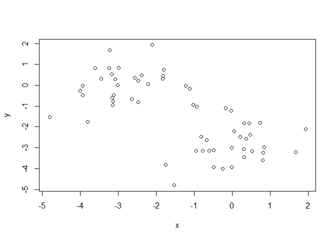

KMeans and more
================
Brandon Gonzalez
February 2, 2019

``` r
tmp <- c(rnorm(30,-3), rnorm(rnorm(30,3)))

x <- cbind(x = tmp, y=rev(tmp))
plot(x)
```



``` r
kmeansData <- kmeans(x, centers=2,nstart=2)
palette(c("red","green"))
plot(x, col=kmeansData$cluster)
```


**Lets use some chemical data now!**

``` r
table <- read.csv("DataFileWithMolWt.csv", header = TRUE)
```

Get the indexes of compounds with a valid molecular weight. Molarity is logS values converted to molarity, we then add as a new column to the table.

``` r
indexes <- table$MolWt > 0 
molarity <- 10 ** table$VALUE
table <- cbind(table, molarity)
```

``` r
name_min_max <- function(x){
  names(x) <- c("min","max")
  return(x)
}
name_list_ranges <- function(x, ... ){
  x <- name_min_max(x)
  return(x)  
}
```

Here we will plot some of the molecular weight data to see what kind of range of molecules we have. We will also go ahead and show the min and max of other properties as well.

``` r
molwt_range <- range(table$MolWt[indexes])
names(molwt_range) <- c("min","max") 
hist(table$MolWt[indexes],xlab="MolWt(g)", main = "Frequency of molecular weights")
```


``` r
logs_range <- range(table$VALUE[indexes])
gPerL_range <- range(table$molarity[indexes]*table$MolWt[indexes])
molarity_range <- range(table$molarity[indexes])

molarity_range <-  name_min_max(molarity_range)
logs_range <- name_min_max(logs_range)
molarity_range
```

    ##          min          max 
    ## 2.398833e-12 3.801894e+01

``` r
logs_range
```

    ##    min    max 
    ## -11.62   1.58

``` r
rescale <- function(x){
  rng <- range(x, na.rm=TRUE)
  (x - rng[1])/(rng[2] - rng[1])
}
```

We will chart the solubility in molarity as the Y-axis with the molecular weight as the x axis. We will also color this by density using custom coloring.

``` r
dcols.custom = densCols( table$MolWt[indexes], table$VALUE[indexes], colramp=colorRampPalette(c("green2", "yellow","red2","purple2")))

plot( table$MolWt[indexes], table$VALUE[indexes], pch=20, xlab="molecular weight (g)", ylab="LogS value", main =  "Solubility in Water")
```


``` r
plot( table$MolWt[indexes], table$VALUE[indexes], pch=20, col=dcols.custom, xlab="molecular weight (g)", ylab="LogS value", main =  "Solubility in Water Heat Map")
```


